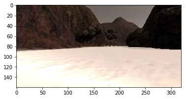
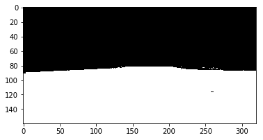
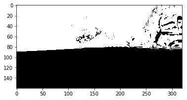
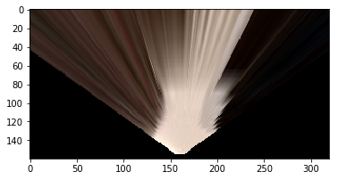
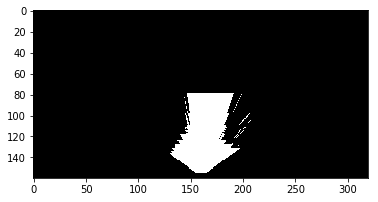
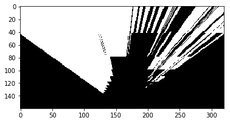

## Project: Search and Sample Return

### Notebook Analysis
#### Obstacle and rock sample identification

##### Color thresholding

Obstacle and rock sample identification (along with navigable terrain identification), was primarily accomplished by segmenting input images using color ranges. This was done using the function `color_thresh_range`, which was defined under the heading _Color Thresholding_. Color thresholding basically means that pixels that have color values that fall within a given range are given a desired color. In our case, we use three threshold ranges, one for the navigable terrain, another one for obstacles, and the third one for rock samples.  All pixels that fall within the color range of navigable terrain are assigned the value of blue, all pixels that fall within the color range of obstacles are assigned the color of red, and all pixels that fall within the color range of rock samples are assigned with the color green.

A new image is generated using the newly assigned colors, resulting in an image where all red pixels are assumed to be obstacles, all blue pixels are assumed to be navigable terrain, and all green pixels are assumed to be rock samples. 

Original image


Show navigable pixels


Show obstacle pixels



```python
def color_thresh_range(img, rgb_lower, rgb_higher):
    """
    takes an image input, and returns an image composed of colors within range
    :param img:
    :param rgb_lower: lower range
    :param rgb_higher: higher range
    :return:
    """
    color_select = np.zeros_like(img[:, :, 0])
    above_thresh = (img[:, :, 0] > rgb_lower[0]) \
                   & (img[:, :, 1] > rgb_lower[1]) \
                   & (img[:, :, 2] > rgb_lower[2])
    below_thresh = (img[:, :, 0] < rgb_higher[0]) \
                   & (img[:, :, 1] < rgb_higher[1]) \
                   & (img[:, :, 2] < rgb_higher[2])

    color_select[above_thresh & below_thresh] = 1
    return color_select
```

##### Perspective Transform

Obstacle and rock sample identification does not end with color thresholding.  Once we know what pixels in an image belong to either navigable terrain, obstacles, or rock samples, we also need to find out where each pixel is located in relation to our rover. To dp this, we use transform our image that has a first person view that looks like this:


Into an image that has a top-down or bird's eye view that looks like this:



This is accomplished by warping the image.  That is, we use specify certain reference points in the image, and we "stretch" these reference points to other predefined areas distorting the image into our desired form.

Since we have already thresholded our images prior to this step, what we will get instead are the following

Original navigable pixels


Warped navigable pixels



Original obstacle pixels


Warped obstacle pixels


The recommended sequence in this project is to first warp the image, then apply image thresholding.  I have reversed the recommended sequence since it was noticed that this above sequence produced images that has less artifacts.

The code we used for warping can be found under the _Perspective Transform_ heading. And the code is shown below

```python
def perspect_transform(img, src, dst):
           
    M = cv2.getPerspectiveTransform(src, dst)
    warped = cv2.warpPerspective(img, M, (img.shape[1], img.shape[0]))# keep same size as input image
    
    return warped

dst_size = 5 
bottom_offset = 6
source = np.float32([[14, 140], [301 ,140],[200, 96], [118, 96]])
destination = np.float32([[image.shape[1]/2 - dst_size, image.shape[0] - bottom_offset],
                  [image.shape[1]/2 + dst_size, image.shape[0] - bottom_offset],
                  [image.shape[1]/2 + dst_size, image.shape[0] - 2*dst_size - bottom_offset], 
                  [image.shape[1]/2 - dst_size, image.shape[0] - 2*dst_size - bottom_offset],
                  ])
my_warped_image = perspect_transform(my_sample_image, source, destination)

```

And finally, once the image has been color threshed and warped, the final step performed on the images is to flip and rotate the image some more, such that the image's y axis is aligned with the rover's left and right, and the image's x axis is aligned with the rovers's front and back. This is done using the `rover_coords` function, which takes as an input the preprocessed input images, and return as a result the x and y coordinates of each of the component pixels of the input image.


#### Image processing and world map generation

Once the input image has been processed to identify which parts are to be considered navigable, obstacles, or rock samples, and also as to how far each pixel is to the rover, we then proceed to figure out which part of the world map the input image belongs to.  This is done by feeding the resultant rover coordinates from `rover_coords`with the position data (x,y, and yaw) that is reported by the rover to the `pix_to_world` function. We basically construct 3 layers of results.  The first layer is for obstacles, the second layer is for rock samples, and the third layer is for navigable pixels. Once done, we then layer the three on top of each other to form an RGB image, which we now use as our world map.

### Autonomous Navigation and Mapping

#### perception_step() and decision_step(): code and functionality
Fill in the perception_step() (at the bottom of the perception.py script) and decision_step() (in decision.py) functions in the autonomous mapping scripts and an explanation is provided in the writeup of how and why these functions were modified as they were.

**Perception Step**

For the perception step, we basically followed the steps we outlined above, with a couple of minor modifications.  The first modification is to only process images when the rover is fairly horizontal or flat against the ground, that is, when roll and pitch values are do not exceed +-0.5 degrees from zero. This can be seen in lines 191 to 194 of `perception.py`. The code is reproduced below.

```python
    if ((Rover.roll > 359.5) or (Rover.roll < 0.5)) and ((Rover.pitch > 359.5) or (Rover.pitch < 0.5)):
        Rover.worldmap[obstacle_y_world, obstacle_x_world, 0] = 255
        Rover.worldmap[rock_sample_y_world, rock_sample_x_world, 1] = 255
        Rover.worldmap[y_world, x_world, 2] = 255
```

The second minor modification is we cropped the upper part of the image, thereby not processing points that are too far away from the rover, as the further the points are from the rover, the higher the inaccuracies.  This resulted in higher accuracy scores. This can be seen in lines 150 to 155 of `perception.py`.  The code is reproduced below.

```python
    # remove the upper part of the image. this is because what's seen further away is normally
    # inaccurate.
    bottom_offset = 100
    warped_obstacle_terrain[0:bottom_offset, :] = warped_obstacle_terrain[0:bottom_offset, :] * 0
    warped_navigable_terrain[0:bottom_offset, :] = warped_navigable_terrain[0:bottom_offset, :] * 0
    warped_rock_sample_thresh[0:bottom_offset, :] = warped_rock_sample_thresh[0:bottom_offset, :] * 0

```

**Decision Step**

No departures were made from the original `decision.py`. The current decision tree is fairly robust, and can produce mapping results that meet the given fidelity and coverage specifications.


#### Results of autonomous mapping

Running the rover in autonomous mode given the above code, at 640 x 480 resolution, and at the fastest graphics quality, has resulted in map coverage values that exceed 50% and fidelity values that exceed 90%. The fairly low coverage value of 50% can be attributed to the fact that the rover has a fairly simple (though robust) decision tree.  On the other hand, the fairly high fidelity values that exceed 90% could be attributed to the fact that only points near the rover are plotted onto the world map.  As mentioned earlier, avoiding the plotting of further away pixels that also tend to be more inaccurate greatly helps the fidelity of the map produced.  On top of this, limiting the inputs processed to those that were only taken when the rover is close to flat on the ground is another method to reduce the introduction of inaccuracies on to the world map.


#### Potential improvements

Improving the area covered can be accomplished by providing the rover with a more sophisticated decision tree. Like say for instance, if we were to provide the rover with the means to remember where it has been in the past, such that it will only visit unexplored areas. This would definitely result in higher coverage values.  Furthermore, adding path planning to the abilities of the rover would allow it to enter areas that are ignored for being too small by the current setup.

However, both of the suggested improvements have been attempted in previous incarnations of the project. Though it has provided the rover with far greater control (i.e. the rover can be instructed to go from arbitrary point A to arbitrary point B), it has also introduced other complexities such as difficulty in choosing destination targets, more complex error recovery routines, obstacle collisions probably due to low resolution maps,  as well as far higher compute requirements for higher resolutions maps, especially when using algorithms such as A* which may bog down the rover while generating the path.

Regardless, the more basic implementation was chosen, as it was successfully tested to actually comply with the specifications set by the project. It may be possible for the experimental implementation to meet specifications as well, however this has not been witnessed yet, since extended runs of the rover simulator inevitably results in blacking out of the screen and a forced restart of the aging local machine. Should the reader be interested in testing it out, it can be accessed from the `a_star_implementation` branch of the project's github.